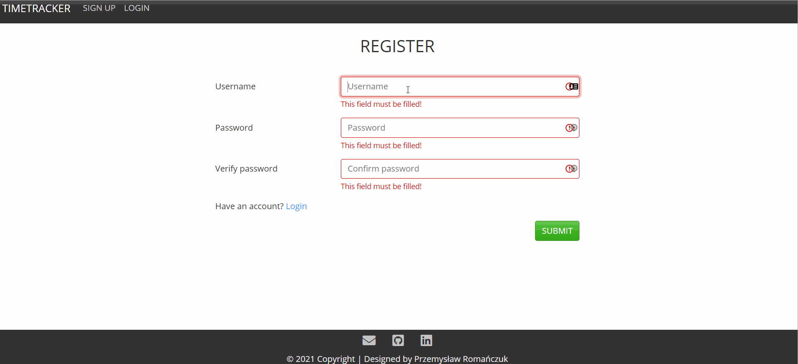

<div align="center">
<h1 align="center">Timetracker</h1></div>


## Table of contents
* [General info](#general-info)
* [Technologies](#technologies)
* [Demo](#demo)
* [Setup & Installation](#setup-&-installation)
* [Running The App](#running-the-app)
* [Viewing The App](#viewing-the-app)
* [Features](#features)
* [Status](#status)
* [Contact](#contact)

## General info
**Timetracker** is an app created in **Flask** that helps you manage projects, work hours or vacation days. \
The main purpose of creating it was to learn more about Flask and to make it useful in everyday work.

## Technologies
* Python 3.9.x
* Flask 1.1.x
* SQLAlchemy 1.3.x
* SQLite3
* Bootstrap 5
* HTML5
* CSS3

## Demo
Check app demo [here.](https://my-timetracker.herokuapp.com/)

## Setup & Installation
Make sure you have the latest version of Python and pip installed

Clone the repository using the following command
```bash
git clone https://github.com/Gamattowicz/Timetracker_Flask.git
```
Create a virtual environment
```bash
python -m venv venv
```
Active the virtual environment
```bash
.\env\Scripts\activate
```
Install all the project Requirements
```bash
pip install -r requirements.txt
```
Create file with environment variables, where <secret_key_name> is your unique data. It should be hidden.
```bash
echo SECRET_KEY=<secret_key_name> > .env
```
## Running The App
```bash
python timetracker.py
```

## Viewing The App
Go to `http://127.0.0.1:5000`

## Features
* User management system 
* Calculating and adding vacation days 
* Projects CRUD and schedule 
* Hours CRUD and calculation of overtime 
* Measuring working time and copying values 

**To Do:**
* Add more tests

## Status 
Project in progress.

## Contact
Created by [@Gamattowicz](https://github.com/Gamattowicz) - feel free to contact me!